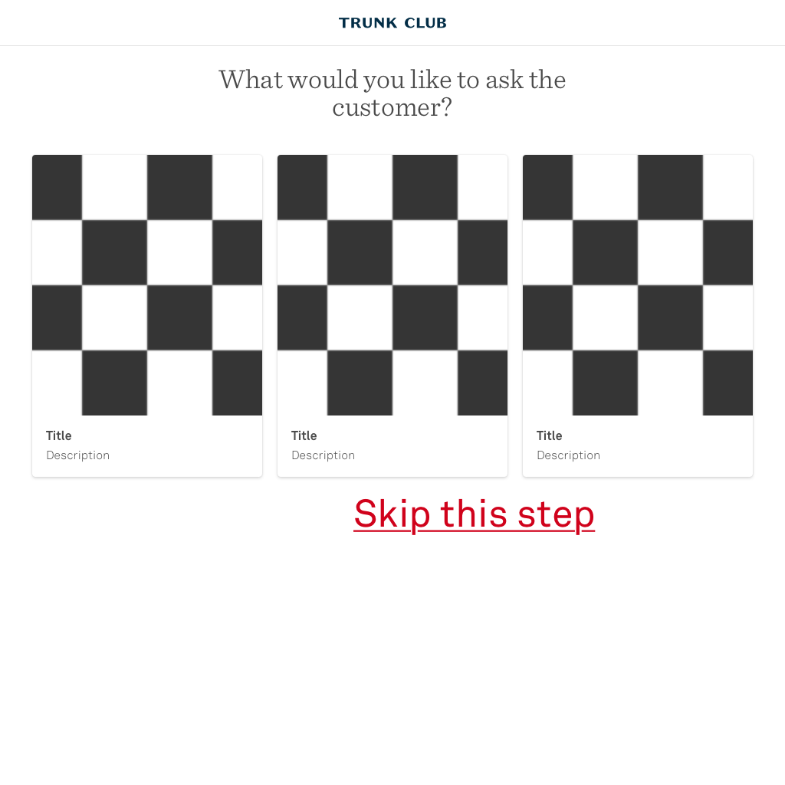
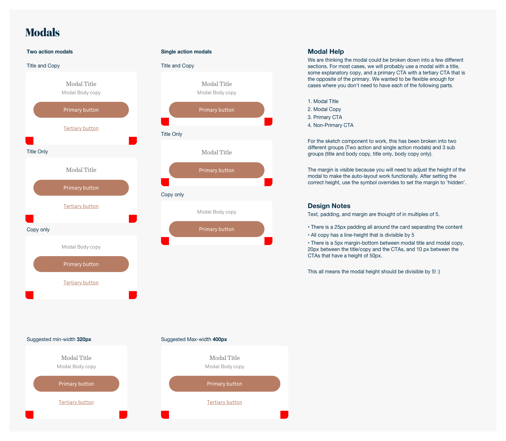
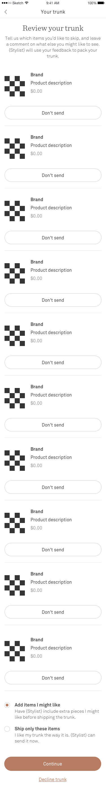

# Artboards

This is an autogenerated file showing all the artboards. Do not edit it directly.

## Active

## Avatar 

## Banner 

## Banner Status

## Browser 

## Button 

## Buttons

## Calendar 

## Calendar

## Cards

## Cell Divider 

## Color 

## Date Left Aligned

## Desktop-Detail

## Desktop-Discover

## Desktop-Focused

## Desktop-Form-Address

## Desktop-Form

## Desktop-Grid Copy

## Desktop-Grid

## Desktop-Messages

## Desktop-Modal

## Desktop-Onboarding Copy

## Desktop-Onboarding-2

## Desktop-Onboarding-3

## Desktop-Onboarding

## Desktop-Profile

## Desktop-Rating

## Desktop-Scheduling

## Form 

## Form Inputs

## Hand

## Icon 

## Image placeholder 

## Left 

## Message 

## Messaging 

## Messaging

## Mobile-Discover

## Mobile-Exchange Modal

## Mobile-Focused

## Mobile-Form-Address

## Mobile-Form

## Mobile-Grid

## Mobile-Home Try-on

## Mobile-Keep Modal

## Mobile-Messages

## Mobile-Modal

## Mobile-Onboarding-2

## Mobile-Onboarding-3

## Mobile-Onboarding

## Mobile-Product Detail

## Mobile-Profile

## Mobile-Rating

## Mobile-Return Modal

## Mobile-Scheduling

## Modal 

## Modals

## Nav 

## Navigation

## Off

## On

## Onboarding 

## Onboarding Card

## Pinterest

## Product 

## Product Card 

## Profile 

## Progress Indicator 

## Rating 

## Ratings 

## Ratings

## Right 

## Section header

## Status Bar

## Table Cell 

## Template Icon

## Text 

## Transactional Email Template

## Typography

## Wordmark

## iOS Specific

## iOS-Focused

## iOS-Form

## iOS-Grid

## iOS-Home Try-on

## iOS-Messages

## iOS-Modal

## iOS-Onboarding-2

## iOS-Onboarding-3

## iOS-Onboarding

## iOS-Product Detail

## iOS-Profile

## iOS-Rating

